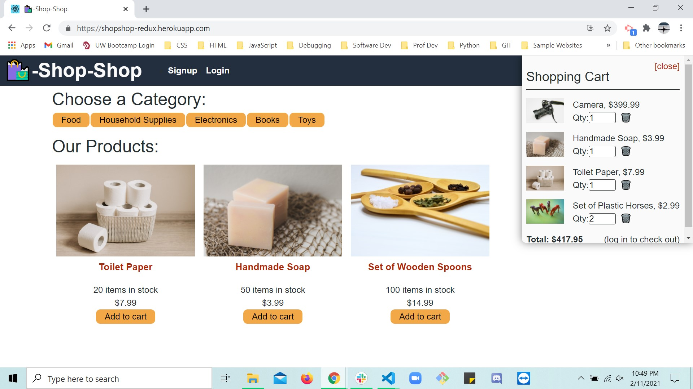

# shopShop-Redux

## Description
A MERN e-commerce platform that uses Redux to manage global state and Stripe to handle payments.

### Programming Languages, Platforms and Technologies Used:
- Apollo server
- CSS
- HTML
- ES6
- GraphQL
- Javascript
- JSX
- MERN stack:
-- MongoDB
-- Express
-- React
-- Node.js
- Redux
- Stripe

### NPM Packages:
- @apollo/react-hooks
- @stripe/stripe-js
- @testing-library/jest-dom
- @testing-library/react
- @testing-library/user-event
- apollo-boost
- apollo-link-context
- bcrypt
- concurrently
- express
- graphql
- graphql-tag
- jsonwebtoken
- jwt-decode
- mongoose
- react
- react-dom
- react-redux
- react-router-dom
- react-scripts
- redux
- stripe

## Table of Contents:

- [Usage](#usage)
- [Acknowledgements](#acknowledgements)
- [Contributions](#contribution-guidelines)
- [Questions?](#questions?)

## <a name="usage">Usage</a>:

GitHub Repository:
https://github.com/SMKrizan/shopShop-Redux

Deployed on Heroku:
https://shopshop-redux.herokuapp.com/

## <a name="acknowledgements">Acknowledgements</a>:
Made with ☕+❤️ by Sara Krizan and in consultation with several LAs, TA, and learning instructor through the University of Wisconsin Extended Campus Coding Bootcamp.

    
## <a name="contribution-guidelines">Contributions</a>:
Please feel free to contact me via my GitHub account below with any requests to contribute to this project or collaborate on future works.
    

## <a name="questions?">Questions?</a> 
Sara Krizan    
[GitHub](https://github.com/SMKrizan)
